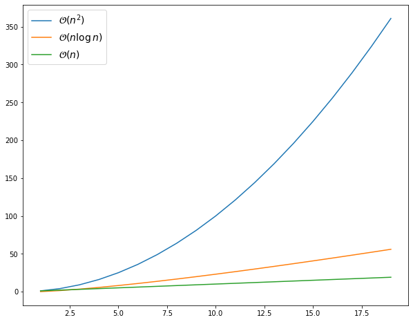

## 1. Le principe

La méthode "diviser pour régner" (*divide and conquer* en anglais) est une stratégie algorithmique qui se décompose en **trois étapes** :

1. **Diviser** : décomposer le problème initial en **sous-problèmes** de même nature, mais de taille plus petite.
2. **Régner** : résoudre chaque sous-problème, en général **récursivement**, jusqu'à atteindre un cas de base trivial.
3. **Combiner** : fusionner les solutions des sous-problèmes pour construire la solution du problème initial.

::: {.callout-note}
## Exemples déjà rencontrés

Nous avons déjà rencontré cette stratégie :

- **Recherche dichotomique** dans un tableau trié (vue en première et en mathématiques) : on divise l'espace de recherche par 2 à chaque étape.
- **Recherche dans un ABR** (arbre binaire de recherche) : à chaque nœud, on élimine un sous-arbre, ce qui s'apparente à une dichotomie.
:::

## 2. Le tri fusion

Le **tri fusion** (*merge sort*) est un algorithme de tri qui applique la méthode "diviser pour régner" :

1. **Diviser** : couper la liste en deux moitiés.
2. **Régner** : trier récursivement chaque moitié.
3. **Combiner** : fusionner les deux moitiés triées en une seule liste triée.

Voici une description de cet algorithme en pseudo-code :

```txt
fonction tri_fusion(liste : tableau d'entiers) -> tableau d'entiers
    si longueur(liste) <= 1
        retourner liste
    sinon
        milieu = longueur(liste) / 2
        liste_gauche = tri_fusion(liste[1...milieu])
        liste_droite = tri_fusion(liste[milieu+1...longueur(liste)])
        retourner fusionner(liste_gauche, liste_droite)

fonction fusionner(liste_gauche : tableau d'entiers, liste_droite : tableau d'entiers) -> tableau d'entiers
    i = 0
    j = 0
    liste_fus = []

    // Fusionner en comparant les éléments de chaque liste
    tant que i < longueur(liste_gauche) et j < longueur(liste_droite)
        si liste_gauche[i] <= liste_droite[j]
            ajouter liste_gauche[i] à liste_fus
            i = i + 1
        sinon
            ajouter liste_droite[j] à liste_fus
            j = j + 1

    // Copier les éléments restants de liste_gauche (s'il y en a)
    tant que i < longueur(liste_gauche)
        ajouter liste_gauche[i] à liste_fus
        i = i + 1

    // Copier les éléments restants de liste_droite (s'il y en a)
    tant que j < longueur(liste_droite)
        ajouter liste_droite[j] à liste_fus
        j = j + 1

    retourner liste_fus
```
::: {.callout-caution}
## Exercice

Dérouler à la main l'exécution de cet algorithme avec la liste [5, 2, 4, 6, 1, 3]. Présenter ce déroulement sous forme d'un arbre.
:::

**Implémentation** en Python :

```Python
def tri_fusion(liste):
    if len(liste) <= 1:
        return liste
    else:
        milieu = len(liste) // 2
        liste_gauche = tri_fusion(liste[:milieu])
        liste_droite = tri_fusion(liste[milieu:])
        return fusionner(liste_gauche, liste_droite)


def fusionner(liste_gauche, liste_droite):
    i = 0
    j = 0
    liste_fus = []

    # Fusionner en comparant les éléments de chaque liste
    while i < len(liste_gauche) and j < len(liste_droite):
        if liste_gauche[i] <= liste_droite[j]:
            liste_fus.append(liste_gauche[i])
            i += 1
        else:
            liste_fus.append(liste_droite[j])
            j += 1

    # Copier les éléments restants
    while i < len(liste_gauche):
        liste_fus.append(liste_gauche[i])
        i += 1
    while j < len(liste_droite):
        liste_fus.append(liste_droite[j])
        j += 1

    return liste_fus
```

Test du programme en console :

```python
>>> liste = [5, 2, 4, 6, 1, 3]
>>> liste_triee = tri_fusion(liste)
>>> print(liste_triee)
[1, 2, 3, 4, 5, 6]
```

**Visualisation** de l'exécution avec Python Tutor : 

<iframe width="100%" height="800" frameborder="0" src="https://pythontutor.com/iframe-embed.html#code=def%20tri_fusion%28liste%29%3A%0A%20%20%20%20if%20len%28liste%29%20%3C%3D%201%3A%0A%20%20%20%20%20%20%20%20return%20liste%0A%20%20%20%20else%3A%0A%20%20%20%20%20%20%20%20milieu%20%3D%20len%28liste%29%20//%202%0A%20%20%20%20%20%20%20%20liste_gauche%20%3D%20tri_fusion%28liste%5B%3Amilieu%5D%29%0A%20%20%20%20%20%20%20%20liste_droite%20%3D%20tri_fusion%28liste%5Bmilieu%3A%5D%29%0A%20%20%20%20%20%20%20%20return%20fusionner%28liste_gauche%2C%20liste_droite%29%0A%0A%0Adef%20fusionner%28liste_gauche%2C%20liste_droite%29%3A%0A%20%20%20%20i%20%3D%200%0A%20%20%20%20j%20%3D%200%0A%20%20%20%20liste_fus%20%3D%20%5B%5D%0A%0A%20%20%20%20%23%20Fusionner%20en%20comparant%20les%20%C3%A9l%C3%A9ments%20de%20chaque%20liste%0A%20%20%20%20while%20i%20%3C%20len%28liste_gauche%29%20and%20j%20%3C%20len%28liste_droite%29%3A%0A%20%20%20%20%20%20%20%20if%20liste_gauche%5Bi%5D%20%3C%3D%20liste_droite%5Bj%5D%3A%0A%20%20%20%20%20%20%20%20%20%20%20%20liste_fus.append%28liste_gauche%5Bi%5D%29%0A%20%20%20%20%20%20%20%20%20%20%20%20i%20%2B%3D%201%0A%20%20%20%20%20%20%20%20else%3A%0A%20%20%20%20%20%20%20%20%20%20%20%20liste_fus.append%28liste_droite%5Bj%5D%29%0A%20%20%20%20%20%20%20%20%20%20%20%20j%20%2B%3D%201%0A%0A%20%20%20%20%23%20Copier%20les%20%C3%A9l%C3%A9ments%20restants%0A%20%20%20%20while%20i%20%3C%20len%28liste_gauche%29%3A%0A%20%20%20%20%20%20%20%20liste_fus.append%28liste_gauche%5Bi%5D%29%0A%20%20%20%20%20%20%20%20i%20%2B%3D%201%0A%20%20%20%20while%20j%20%3C%20len%28liste_droite%29%3A%0A%20%20%20%20%20%20%20%20liste_fus.append%28liste_droite%5Bj%5D%29%0A%20%20%20%20%20%20%20%20j%20%2B%3D%201%0A%0A%20%20%20%20return%20liste_fus%0A%0A%0Aliste%20%3D%20%5B5%2C%202%2C%204%2C%206%2C%201%2C%203%5D%0Aliste_triee%20%3D%20tri_fusion%28liste%29%0Aprint%28liste_triee%29%0A&codeDivHeight=400&codeDivWidth=350&cumulative=false&curInstr=0&heapPrimitives=nevernest&origin=opt-frontend.js&py=3&rawInputLstJSON=%5B%5D&textReferences=false"> </iframe>

### Complexité de l'algorithme

À chaque appel récursif, la liste est coupée en deux. Il y a donc $\log_2 n$ **niveaux** de récursion. À chaque niveau, l'ensemble des fusions parcourt **tous les éléments** de la liste, ce qui représente un travail en $\mathcal{O}(n)$ par niveau.

Le coût total est donc :

::: {.callout-important}
## Complexité de l'algorithme de tri fusion

La complexité (temporelle) de l'algorithme de tri fusion est en $\mathcal{O}(n\log n)$, où $n$ est la taille de la liste à trier.

Il s'agit donc d'une complexité **quasi-linéaire**.
:::

Pour comparaison, les algorithmes de tri étudiés en première (tri par insertion et tri par sélection) ont une complexité **quadratique** $\mathcal{O}(n^2)$ dans le pire des cas. Le tri fusion est donc **beaucoup plus efficace** pour de grandes listes.

