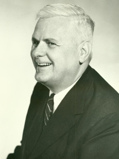

## La thèse de Church

Dans le cadre de la spécialité NSI, nous utilisons le langage Python,
même si nous savons qu'il existe bien d'autres langages de
programmation, comme JavaScript, C, Perl, Java, Fortran, etc.

Un même algorithme peut être traduit en un programme dans l'un ou
l'autre des langages de notre choix.

Cela revient à dire que tous les langages de programmation usuels ont
la même puissance d'expression algorithmique, que chacun permet de
programmer les mêmes fonctions que tous les autres. Cela définit ainsi
**un modèle de calcul** : 

::: {.callout-tip}
## Fonction calculable

on dira qu'une fonction est calculable si elle
peut être programmée dans l'un ou l'autre des langages de
programmation usuels.
:::

Dans ce cours, nous utiliserons le langage Python comme témoin :
**une fonction est calculable si on peut la programmer en Python.**

Il existe d'autres modèles de calcul, comme les
fonctions récursives, les machines de Turing, que nous ne
développerons pas ici, et qui ne font pas partie des attendus du
programme.

La **thèse de Church** [^1] postule que tous ces modèles
de calcul sont équivalents : une fonction calculable pour un modèle
l'est pour un autre. Cela nous permet d'utiliser le modèle des
fonctions programmables en Python **sans perdre de généralité**.

{width=30%}

## Fixons le vocabulaire

### Problèmes, instances, prédicats

La notion de problème n'est pas si simple à définir. Par exemple : le
problème de savoir si un nombre est premier. De quoi s'agit-il
précisément ?

Si j'ai calculé une table des nombres premiers jusqu'à un million, et
si on me donne le nombre 870 671, il me suffit de consulter la table
pour constater qu'il est effectivement premier. Mais bien entendu
cette méthode a ses limites.

Si on note $P$ l'ensemble des nombres premiers, on voudrait pouvoir dire
de **tout** entier naturel $n$ si oui ou non $n \in P$.

Autrement dit, on voudrait avoir accès à une fonction $f ∶ \mathbb{N} \mapsto
\{Vrai,Faux\}$ telle que $f(n)$ est $Vrai$ si et seulement si $n\in P$.

[^1]: **Alonzo Church** est un logicien américain, né en 1903 et mort en 1995. Trois de ses étudiants sont également à l'origine des fondements théoriques de l'informatique : Stephen Kleene, John Barkley Rosser et Alan Turing.

::: {.callout-tip}
## Problème décidable

Dire que le problème est **décidable**, c'est dire qu'il existe
un programme Python permettant de calculer $f(n)$ pour tout entier
$n$.
:::

::: {.callout-tip}
## Prédicat

Un prédicat est une fonction qui
prend des valeurs booléennes, c'est-à-dire dans l'ensemble
${Vrai,Faux}$.
:::

::: {.callout-tip}
## Problème de décision

Un **problème de décision** est une question dont la réponse est toujours
*oui* ou *non*, posée sur un ensemble de **données** appelées **instances**.
Les instances pour lesquelles la réponse est *oui* sont appelées les
**instances positives**.
:::

Par exemple, pour le problème de la primalité, les instances sont les entiers
naturels et les instances positives sont les nombres premiers.

On peut présenter un problème de décision de la façon suivante :

#### Nom du problème

**Donnée :** spécification d'une instance

**Réponse :** propriété portant sur une instance qui spécifie les
instances positives

Ce qui donne pour le problème de la primalité :

#### Primalité d'un entier 

**Donnée :** un entier naturel

**Réponse :** décider si ce nombre est premier

Le prédicat associé à un problème de décision est la fonction qui, à chaque
instance, associe *Vrai* si elle est positive, *Faux* sinon. Pour le problème
de la primalité, ce prédicat est la fonction ``isprime``.

Prenons un autre exemple : colorier un graphe avec un nombre fixé de
couleurs, c'est colorier ses sommets de sorte que deux sommets reliés
par une arête du graphe ne sont jamais de la même couleur.

On peut alors définir :

#### Coloration d'un graphe 

**Donnée :** un graphe non orienté et un nombre $c$ de couleurs

**Réponse :** décider si on peut colorier ce graphe avec $c$ couleurs

Notons qu'ici les instances sont des couples $(G, c)$ où $G$ est un
graphe et $c$ un entier.

Nos exemples peuvent être plus exotiques, comme :

#### Programme Python bien formé

**Donnée :** une chaîne de caractères

**Réponse :** décider si le programme constitué de la chaîne de
caractère donnée est un programme Python bien formé, c'est-à-dire sans
erreurs de syntaxe

### Problèmes de décision décidables

Un problème de décision est **décidable** si on peut écrire un programme
en Python qui permette de calculer le prédicat associé au problème.

**Attention !** On ne s'intéresse ici pas du tout aux questions de
complexité : que l'algorithme de calcul du prédicat soit coûteux ou
pas n'intervient pas, c'est l'existence d'un tel algorithme qui permet
de conclure, et pas ses performances.

Par exemple, on peut écrire un programme qui teste si un nombre est
premier, comme celui-ci :

~~~~{.python}
def isprime(n):
    # on élimine les cas triviaux
    if n < 2:
        return False
    if n % 2 == 0: 
        return False
    # on teste tous les diviseurs possibles (il y a beaucoup plus efficace !)
    for d in range(3,n,2):
        if n % d == 0 : return False
    return True
~~~~

On aura remarqué que le prédicat renvoie une réponse (``True`` ou ``False``)
pour n'importe quelle donnée. En particulier, il ne sombre jamais dans
une boucle infinie : il termine toujours. On peut donc affirmer que
**le problème de la primalité est décidable**.

Le problème de la coloration des graphes pose un problème de
programmation plus difficile, et nous ne détaillerons pas ici un
programme Python pour le prédicat associé : contentons-nous de dire
qu'il suffit de balayer de façon systématique les coloriages de tous
les sommets avec les couleurs disponibles, et, pour chaque coloriage,
de vérifier, par un balayage systématique des arêtes, si deux sommets
reliés sont coloriés de la même façon. Mais, pour un graphe à $n$
sommets et $p$ arêtes et $c$ couleurs, cela va coûter cher : un nombre
d'opérations de l'ordre de $c^n \times p$.

Mais on ne s'intéresse pas du tout ici à la complexité et l'important
est qu'on puisse affirmer que **le problème de la coloration des
graphes est décidable**.

Le troisième problème que nous avons présenté est, lui aussi, décidable
: la preuve peut se limiter à rappeler qu'il existe un interpréteur du
langage Python, qui en particulier est capable de décider si oui ou
non une chaîne de caractères représente un programme Python
syntaxiquement correct. Cet interpréteur est le plus souvent écrit
dans le langage C, mais la thèse de Church nous indique qu'on pourrait
aussi le programmer en Python.

**Remarque importante :** la question de la calculabilité d'une
fonction ou de la décidabilité d'un problème est une question
totalement différente de celle de la complexité des algorithmes
concernés.

## Le problème de l\'arrêt

### Les fonctions calculables

::: {.callout-tip}
## Fonction calculable

Une fonction $f ∶ E \mapsto V$ (où $V$ n'est pas nécessairement
l'ensemble $\{Vrai,Faux\}$) est dite **calculable** s'il existe un programme
Python qui prend en entrée une valeur quelconque $x\in E$ et renvoie
toujours la valeur $f(x)$ (ce qui signifie en particulier que le
programme termine pour toute entrée $x$ et renvoie $f(x)$).
:::

On a déjà dit qu'il était **équivalent de dire qu'un problème de
décision est décidable ou que le prédicat associé est calculable**.

### Les programmes comme données

Un programme écrit en Python n'est autre qu'une chaîne de caractères :
c'est le texte même du programme.

Bien sûr, pour un même programme, en ajoutant des espaces à la fin
d'une ligne, ou entre deux mots, on obtient un autre programme qui
calcule exactement les mêmes choses. Mais peu importe.

Cela permet de considérer des fonctions qui prennent en entrée des
programmes.

::: {.callout-note}
## Exemples concrets de programmes traitant d'autres programmes

Cette idée est omniprésente en informatique :

- Un **interpréteur Python** est lui-même un programme (écrit en C, par exemple) qui prend en entrée un programme Python (une chaîne de caractères) et l'exécute. La thèse de Church nous assure qu'on pourrait tout aussi bien écrire cet interpréteur en Python.
- Un **compilateur** est un programme qui prend en entrée le texte source d'un programme et produit en sortie un programme en langage machine.
- **Télécharger un logiciel** revient à recevoir une suite de bits qui constitue un programme : le système d'exploitation, lui-même un programme, va ensuite l'exécuter.
- Un **système d'exploitation** (Linux, Windows…) est un programme qui en gère d'autres : il les lance, les suspend, les arrête, alloue de la mémoire à chacun.
:::

### Le problème de l'arrêt est indécidable

Voici tout d'abord la définition du problème :

**Problème de l'arrêt**

**Donnée :** le couple constitué d'un programme Python $π$ pour une
fonction $f$ qui prend un argument, et d'une valeur $x$ pour cet
argument

**Réponse :** décider si le calcul de $f(x)$ par le programme $π$
termine ou ne termine pas

Une instance est donc un couple $(π, x)$ formé du texte $π$ d'un
programme Python pour une fonction $f$ et d'une valeur $x$ qui a
vocation à être fournie en argument à $f$.

C'est Alan Turing qui, en 1936, dans le cadre de son fameux article *«
On Computable Numbers, with an Application to the Entscheidungsproblem »*, démontre le théorème de l'indécidabilité du problème
de l'arrêt qui s'énonce ainsi :

**Le problème de l'arrêt est indécidable.**

Ce résultat met définitivement fin à tout espoir d'automatiser de
façon algorithmique le calcul de n'importe quelle fonction. C'est ce
qui fait son importance, à la fois historique, scientifique et
philosophique.

{width=30%}

#### Démonstration du théorème

La démonstration classique que nous présentons ici est une preuve par
l'absurde. On suppose donc qu'il existe un programme Python qui décide
du problème de l'arrêt :

~~~~ {.python}
def testARRET(programme,x):
    ...
    if ...:
        # si le programme s'arrête sur l'entrée x
        return True
    else:
        return False
~~~~

On définit alors le programme suivant :

~~~~ {.python code-line-numbers="true"}
def testSurSoi(programme):
    if testARRET(programme,programme):
        while True:
            continue 
    else:
        return True
~~~~

Les lignes 3--4 forment une boucle infinie.

Que se passe-t-il lors de l'appel ``testSurSoi(testSurSoi)`` ?

▷ ou bien cet appel termine, ce qui signifie qu'on n'est pas entré
dans la boucle infinie des lignes 3--4. Mais alors, cela signifie que
l'appel ``testARRET(testSurSoi,testSurSoi)`` a renvoyé la valeur ``False``, ce
qui ne peut arriver que si l'appel ``testSurSoi(testSurSoi)`` ne termine
pas : c'est contradictoire ;

▷ ou bien cet appel ne termine pas, ce qui signifie qu'on est entré
dans la boucle. Cela ne peut arriver que si l'appel ``testSurSoi(testSurSoi)`` termine :
c'est contradictoire.

On aboutit dans tous les cas à une contradiction, ce qui achève notre
démonstration par l'absurde !

**Remarque :** on peut regarder une vidéo très amusante qui illustre
cette célèbre démonstration ici :

<iframe title="Proof That Computers Can't Do Everything (The Halting Problem)" width="560" height="315" src="https://tube-sciences-technologies.apps.education.fr/videos/embed/64112e4c-6a29-4aa6-be5a-11714512e9a2" frameborder="0" allowfullscreen="" sandbox="allow-same-origin allow-scripts allow-popups"></iframe>

