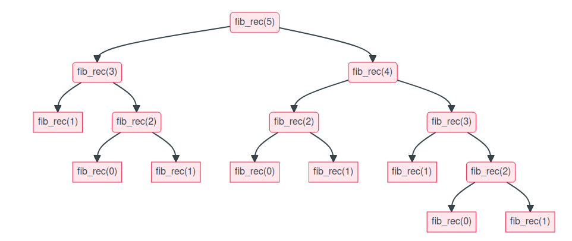

# 1. Rappel introductif : la suite de Fibonacci

La suite de Fibonacci est une suite de nombres entiers notés $F_n$, définie par $F_0=0$, $F_1=1$ et dans laquelle chaque terme est égal à la somme des deux termes qui le précèdent.

D'après la définition de la suite, on a, pour tout entier naturel $n\geqslant 2$ : 
    
$$F_{n}=F_{n-2}+F_{n-1}$$

On en déduit une version **récursive** de l'algorithme de calcul de $F_n$. Cet algorithme a ceci de particulier que chaque fonction procède à **deux** appels récursifs.

```{python}
def fibo_rec(n: int) -> int:
    """Suite de Fibonacci version récursive"""
    # Cas de base
    if n in {0,1}:
        return n
    # Récursion
    else:
        return fibo_rec(n-1) + fibo_rec(n-2)

for k in range(10):
    print(fibo_rec(k))
```

Nous avons vu que cet algorithme est très inefficace. Le calcul de $F_{50}$, par exemple, est très long. En effet, le nombre d'appels récursifs est très grand. Il est possible de démontrer que ce nombre augmente de façon **exponentielle**. Pour calculer $F_{100}$, il y aurait environ $10^{20}$ opérations. À raison de $10^9$ opérations par seconde, le calcul prendra de l'ordre de $10^{11}$ secondes, soit environ 3 000 ans !



Ce phénomène où les mêmes calculs sont répétés de nombreuses fois s'appelle le **chevauchement des sous-problèmes**. Une solution consiste à garder en mémoire les éléments déjà calculés et à ne calculer que les nouveaux éléments encore jamais rencontrés. Une telle démarche relève de la **programmation dynamique**.

```{python}
def fibo_dyn(n: int, memo: dict = None) -> int:
    """Suite de Fibonacci version dynamique (mémoïsation)"""
    if memo is None:
        memo = {0: 0, 1: 1}
    # Cas de base
    if n in {0,1}:
        return n
    # Récursion avec mémoïsation
    if n not in memo:
        memo[n] = fibo_dyn(n-1, memo) + fibo_dyn(n-2, memo)
    return memo[n]

for k in range(10):
    print(fibo_dyn(k))
```

:::{.callout-note}
## Remarque sur l'implémentation
On initialise le dictionnaire `memo` à `None` par défaut, puis on le crée dans le corps de la fonction. C'est une bonne pratique en Python : utiliser un objet **mutable** (comme un dictionnaire) comme valeur par défaut d'un paramètre peut causer des effets de bord indésirables, car cet objet est partagé entre tous les appels.
:::

Avec cette version, le calcul de $F_{50}$ ne pose plus de problème.

# 2. Principe de la programmation dynamique

La programmation dynamique est une méthode algorithmique qui résout des problèmes complexes en les décomposant en sous-problèmes plus simples, en **évitant la redondance** des calculs grâce à la mémorisation des résultats intermédiaires. Cette technique est particulièrement efficace pour les problèmes d'optimisation où l'on cherche la meilleure solution parmi un ensemble de possibilités.

Le principe repose sur deux propriétés clés :

1. **Sous-structure optimale** : un problème possède une sous-structure optimale si une solution optimale globale peut être construite à partir de solutions optimales de ses sous-problèmes. C'est ce qui permet d'écrire une **relation de récurrence** reliant la solution d'un problème à celles de problèmes plus petits.

2. **Chevauchement des sous-problèmes** (*overlapping subproblems*) : les mêmes sous-problèmes apparaissent de nombreuses fois lors de la résolution. C'est précisément ce qui rend l'approche naïve (récursive sans mémorisation) inefficace, et ce qui justifie la mémorisation des résultats.

:::{.callout-warning}
## Attention
La programmation dynamique ne s'applique pas à tous les problèmes ! Ces deux propriétés (**sous-structure optimale** et **chevauchement des sous-problèmes**) doivent être vérifiées.
:::

Pour mettre en œuvre la programmation dynamique, on utilise généralement deux approches :

- **Approche descendante** (*top-down*) avec **mémoïsation** : on écrit une fonction récursive, mais on mémorise les résultats des sous-problèmes déjà résolus (dans un dictionnaire ou un tableau) pour ne pas les recalculer.
- **Approche ascendante** (*bottom-up*) avec **tabulation** : on calcule les solutions des sous-problèmes de manière itérative, en partant des cas les plus simples (cas de base) pour construire progressivement la solution du problème complet.

:::{.callout-tip}
## En résumé

La programmation dynamique transforme un problème complexe en un assemblage de sous-problèmes plus petits. Elle repose sur :

1. L'identification d'une **relation de récurrence** (sous-structure optimale) ;
2. La **mémorisation** des résultats intermédiaires pour éviter les calculs redondants (chevauchement des sous-problèmes).

Cela permet de réduire considérablement le temps de calcul, passant souvent d'une complexité exponentielle à une complexité polynomiale.
:::

**Exemple détaillé : retour sur la chenille vorace**

Une chenille se déplace dans une pyramide de nombres (représentant des pucerons) en partant du sommet, et elle cherche à manger le nombre maximal de pucerons possibles.

```{mermaid}
graph TD
A[3] --> B{7}
A --> C{4}
B --> D{2}
B --> E{4}
C --> E
C --> G{6}
D --> H{9}
D --> I{5}
E --> I
E --> J{9}
G --> J
G --> K{3}
```

Un algorithme naïf, sur l'exemple, consiste à examiner les 8 chemins possibles, et choisir celui qui a le plus grand total. En général, quand la pyramide a $n$ niveaux, il y a $\displaystyle 2^{n-1}$ chemins et $\displaystyle 2^{n}-2$ calculs à effectuer. Donc l'algorithme naïf est de complexité exponentielle.

Le paradigme de la programmation dynamique permet d'obtenir un algorithme efficace en définissant des sous-problèmes, en écrivant une relation de récurrence, puis en donnant un algorithme (avec méthode ascendante ou descendante).

Pour toute position  $\displaystyle x$ dans la pyramide, notons ${\displaystyle v(x)}$ le nombre écrit à cette position et  ${\displaystyle c(x)}$ la somme des nombres traversés dans un chemin maximal issu de $\displaystyle x$. Les sous-problèmes consistent à calculer les valeurs de ${\displaystyle c(x)}$ pour tout ${\displaystyle x}$. Le problème initial consiste à calculer ${\displaystyle c(x)}$ lorsque ${\displaystyle x}$ est le sommet de la pyramide.

Donnons maintenant une définition récursive de ${\displaystyle c(x)}$ :

$$c(x) = \begin{cases} v(x) & \text{si } x \text{ est au dernier niveau de la pyramide} \\ v(x) + \max\big(c(g(x)),\, c(d(x))\big) & \text{sinon} \end{cases}$$

où ${\displaystyle g(x)}$ et ${\displaystyle d(x)}$ désignent respectivement les positions inférieures gauche et droite sous la position ${\displaystyle x}$.

Si on cherche à calculer directement par la définition récursive, on évalue plusieurs fois la même valeur : dans l'exemple ci-dessus, la valeur 4 de la troisième ligne est calculée deux fois en venant de la ligne supérieure (une fois depuis le 7, une fois depuis le 4). Le paradigme de la programmation dynamique consiste à calculer les valeurs ${\displaystyle c(x)}$, soit à l'aide d'un algorithme itératif ascendant en stockant les valeurs déjà calculées dans un tableau, soit à l'aide d'un algorithme récursif descendant avec mémoïsation. L'important est de conserver dans un tableau les valeurs intermédiaires.

:::{.callout-tip}
## Définition

**Mémoïsation** : En informatique, la mémoïsation (ou mémoïzation) est la mise en cache des valeurs de retour d'une fonction selon ses valeurs d'entrée. Le but de cette technique d'optimisation de code est de diminuer le temps d'exécution d'un programme informatique en mémorisant les valeurs retournées par une fonction.
:::

Le nombre de calculs est seulement ${\displaystyle n(n-1)/2}$ : la complexité est donc ramenée à ${\displaystyle O(n^2)}$.

### Algorithme : approche ascendante (bottom-up)

On part du dernier niveau de la pyramide et on remonte niveau par niveau. À chaque position, on calcule $c(x)$ en utilisant les valeurs déjà calculées au niveau inférieur, que l'on stocke dans un tableau.

```
Données : pyramide P à n niveaux, P[i][j] = valeur à la ligne i, colonne j
          (lignes numérotées de 0 à n-1, de haut en bas)
Résultat : la somme maximale d'un chemin du sommet à la base

# Étape 1 : Initialiser un tableau C de mêmes dimensions que P
# Le dernier niveau de C est identique à celui de P (cas de base)
Pour j de 0 à n-1 :
    C[n-1][j] ← P[n-1][j]

# Étape 2 : Remonter niveau par niveau, du bas vers le haut
Pour i de n-2 à 0 (en décroissant) :
    Pour j de 0 à i :
        # c(x) = v(x) + max(c(gauche), c(droite))
        # Les enfants de P[i][j] sont P[i+1][j] (gauche) et P[i+1][j+1] (droite)
        C[i][j] ← P[i][j] + max(C[i+1][j], C[i+1][j+1])

# Étape 3 : La réponse est au sommet
Renvoyer C[0][0]
```

:::{.callout-note}
## Pourquoi ça marche ?
On remplit le tableau **de bas en haut**. Quand on calcule `C[i][j]`, les valeurs `C[i+1][j]` et `C[i+1][j+1]` sont **déjà calculées** (elles l'ont été à l'itération précédente). Chaque sous-problème n'est résolu **qu'une seule fois**.
:::

### Algorithme : approche descendante (top-down) avec mémoïsation

On écrit la relation de récurrence sous forme récursive. On utilise un tableau `memo` pour stocker les résultats déjà calculés et éviter les recalculs.

```
Données : pyramide P à n niveaux, tableau memo initialisé à -1 partout
Résultat : la somme maximale d'un chemin issu de la position (i, j)

Fonction chenille(i, j) :
    # Étape 1 : Vérifier si le résultat est déjà en mémoire
    Si memo[i][j] ≠ -1 :
        Renvoyer memo[i][j]      # résultat déjà connu, pas de calcul !

    # Étape 2 : Cas de base (dernier niveau)
    Si i = n-1 :
        memo[i][j] ← P[i][j]

    # Étape 3 : Cas récursif
    Sinon :
        # On calcule récursivement les deux sous-chemins
        chemin_gauche ← chenille(i+1, j)
        chemin_droite ← chenille(i+1, j+1)
        # On prend le meilleur et on ajoute la valeur courante
        memo[i][j] ← P[i][j] + max(chemin_gauche, chemin_droite)

    Renvoyer memo[i][j]

# Appel initial : on part du sommet
Renvoyer chenille(0, 0)
```

:::{.callout-note}
## Pourquoi ça marche ?
Avant tout calcul, on vérifie si le résultat est déjà dans `memo`. Si oui, on le renvoie immédiatement (coût constant). Sinon, on le calcule **une seule fois** et on le stocke. Ainsi, même si `chenille(2, 1)` est appelée depuis `chenille(1, 0)` et depuis `chenille(1, 1)`, le calcul effectif n'a lieu qu'**une seule fois**.
:::

### Exercice

Dérouler à la main l'algorithme de la chenille vorace sur la pyramide ci-dessus :

1. **Approche ascendante** : construire un tableau en partant du dernier niveau, en calculant $c(x)$ pour chaque position. Montrer les valeurs intermédiaires niveau par niveau.
2. **Approche descendante** : simuler l'exécution récursive de $c(\text{sommet})$ avec mémoïsation. Indiquer pour chaque appel s'il est calculé ou récupéré en mémoire.
3. Donner le chemin optimal et sa valeur.

# 3. Exemple de référence : le rendu de monnaie

[On a déjà vu en classe de première qu'un algorithme glouton pouvait donner une réponse au problème.](https://pnsi.sitelf.fr/26_gloutons/gloutons_cours.html#exemples-dalgorithmes-gloutons)

Fixons les notations. On suppose donné un système monétaire où les valeurs faciales des pièces (ou des billets) sont rangées
en ordre décroissant. Par exemple, le système Euro pourra être décrit par la liste ``euros = [50, 20, 10, 5, 2, 1]``. Pour
payer une somme de 48 unités on pourrait bien sûr payer 48 pièces de 1, ou encore 3 pièces de 10, 3 pièces de 5, 1 pièce de 2 et 1
pièce de 1.

On cherche à payer la somme indiquée, en supposant qu’on a autant de pièces de chaque valeur que de besoin, en utilisant un
nombre minimal de pièces.

L’algorithme glouton consiste à payer d’abord avec la plus grosse pièce possible : ici, il s’agit de 20, puisque 50 > 48. Ayant donné 20,
il reste 28 à payer, et on poursuit avec la même méthode. Finalement, on va payer 48 sous la forme 48 = 20 + 20 + 5 + 2 + 1. On a
eu besoin de 5 pièces.

Considérons un autre système monétaire (en fait c’est l’ancien système impérial britannique) représenté par la liste suivante de
valeurs faciales : ``imperial = [30, 24, 12, 6, 3, 1]``. Pour payer 48 l’algorithme glouton va répondre : 48 = 30+12+6.
À la différence du système euro, pour lequel on peut démontrer que l’algorithme glouton donne toujours la réponse optimale, on
constate que ce n’est pas le cas avec le système impérial, puisque on aurait pu se contenter de 2 pièces : 48 = 24 + 24.

Rappelons comment peut se programmer l’algorithme glouton.

```{python}
euros = [50, 20, 10, 5, 2, 1]
imperial = [30, 24, 12, 6, 3, 1]

def glouton(valeursFaciales, somme):
    i = 0 # index de la pièce qu'on va essayer
    p = len(valeursFaciales) # nombre de valeurs de pièces disponibles
    monnaie = [] # liste des pièces rendues
    while i<p and somme>0:
        if valeursFaciales[i]>somme:
            i += 1
        else:
            monnaie.append(valeursFaciales[i])
            somme -= valeursFaciales[i]
    if somme==0:
        return monnaie
    else:
        return None
```

L’appel ``glouton(euros, 48)`` renvoie la liste ``[20, 20, 5, 2, 1]``; l’appel ``glouton(imperial, 48)`` renvoie la liste
``[30, 12, 6]``.

La réponse optimale est celle qui utilise le nombre minimal de pièces. On a vu que l’algorithme glouton échoue à la trouver en général
(l’exemple de rendre 48 avec le système impérial suffit à le prouver).

Une approche récursive permet de résoudre le problème : soit $x$ une valeur faciale de l’une des pièces du système monétaire. Pour
rendre une somme $s$ de façon optimale, si l’on veut utiliser au moins une fois la pièce $x$, il suffit de rendre $x$ et la somme $s − x$ de
façon optimale. Il n’y a plus qu’à choisir, parmi tous les choix possibles de $x$, celui qui permet d’utiliser le minimum de pièces.
Autrement dit, si l'on appelle $f(s)$ le nombre minimal de pièces qu'il faut utiliser pour payer la somme $s$, on a simplement $f(0) = 0$ et

$$f(s) = \min_{x\leqslant s} (1 + f(s − x))$$

le minimum étant calculé sur toutes les valeurs $x$ d’une pièce.

Cette remarque permet d’écrire le programme récursif suivant :

```{python}
from math import inf

def dynRecursif(valeursFaciales, somme):
    if somme < 0:
        return inf
    elif somme == 0:
        return 0
    mini = inf
    for x in valeursFaciales:
        if somme >= x:
            mini = min(mini, 1 + dynRecursif(valeursFaciales, somme - x))
    return mini
```

On a importé du module ``math`` la valeur spéciale ``inf`` qui représente l’infini : pour tout entier ``a``, l’expression a`` < inf`` vaut ``True``.

Hélas, l’exécution de l’appel ``dynRecursif(euros, 48)`` est extrêmement lente. les mêmes calculs étant effectués de façon
répétée. Une analyse du problème montrerait que la complexité est exponentielle.

Une idée classique consiste à mémoriser les résultats des appels pour être sûr qu’on n’aura pas besoin de les calculer plusieurs fois.

## 3.1. Approche ascendante (itérative avec tabulation)

Ici, le calcul de ``f(s)`` utilise le calcul de ``f(s − x)`` pour chaque valeur de ``x``. Autrement dit, ``f(s)`` n'utilise au plus que les valeurs de ``f(s − 1)``, ``f(s − 2)``, …, ``f(3)``, ``f(2)``, ``f(1)``.

On va donc créer un tableau ``f`` de taille ``somme + 1`` et remplir les cases dans l'ordre croissant des indices. Quand on calcule ``f[s]``, toutes les valeurs ``f[s - x]`` dont on a besoin sont déjà calculées et stockées dans le tableau.

```{python}
def dynMemoise(valeursFaciales, somme):
    f = [0] * (somme + 1)
    for s in range(1, somme + 1):
        f[s] = inf
        for x in valeursFaciales:
            if s >= x:
                f[s] = min(f[s], 1 + f[s - x])
    return f[somme]
```

Le calcul de ``f(48)`` va peut-être utiliser plusieurs fois la valeur de ``f(8)``, mais celle-ci n’aura cette fois été calculée qu’une seule fois, et aussitôt rangée en mémoire. Cela ne fonctionne que parce que pour calculer ``f(48)``, par exemple, on a recours seulement aux
valeurs de ``f(s)`` pour ``s < 48``.

Cette fois l’appel ``dynMemoise(euros, 48)`` répond immédiatement ``5`` (l’algorithme glouton avait bien trouvé la réponse optimale)
et ``dynMemoise(imperial, 48)`` renvoie ``2``, ce qui correspond à la solution optimale ``48 = 24 + 24``.

L’algorithme est de complexité tout à fait raisonnable : les deux boucles emboîtées correspondent à un temps d’exécution de l’ordre
de ``somme * len(valeursFaciales)``.

En revanche, il a un coût en espace (ou en mémoire) : il faut réserver la place nécessaire pour ranger toutes les valeurs de ``f(n)``.

## 3.2. Approche descendante (récursive avec mémoïsation)

Il s'agit de l'approche utilisée pour la suite de Fibonacci : on utilise une fonction récursive et on mémorise les résultats déjà calculés dans un dictionnaire. La vérification de la présence en mémoire doit se faire **avant** la boucle sur les pièces : si le résultat est déjà connu, on le retourne immédiatement sans aucun calcul supplémentaire.

```{python}
def dynRecursifMem(valeursFaciales, somme, mem={}):
    if somme < 0:
        return inf
    elif somme == 0:
        return 0
    # Si le résultat a déjà été calculé, on le retourne immédiatement
    if somme in mem:
        return mem[somme]
    # Sinon, on calcule le minimum sur toutes les pièces possibles
    mini = inf
    for x in valeursFaciales:
        if somme >= x:
            mini = min(mini, 1 + dynRecursifMem(valeursFaciales, somme - x, mem))
    # On mémorise le résultat avant de le retourner
    mem[somme] = mini
    return mini
```	

Cette fois, l'exécution de ``dynRecursifMem(euros, 48)`` est immédiate.

## 3.3. Comparaison des approches

| Approche | Complexité temporelle | Complexité spatiale | Avantages | Inconvénients |
|----------|----------------------|--------------------|-----------|--------------|
| Récursive naïve | Exponentielle | Profondeur de pile | Simple à écrire | Beaucoup trop lente |
| Descendante (mémoïsation) | $O(s \times p)$ | $O(s)$ + pile | Naturelle (suit la récurrence) | Profondeur de récursion limitée |
| Ascendante (tabulation) | $O(s \times p)$ | $O(s)$ | Pas de récursion | Moins intuitive |

où $s$ est la somme à rendre et $p$ le nombre de valeurs faciales.
